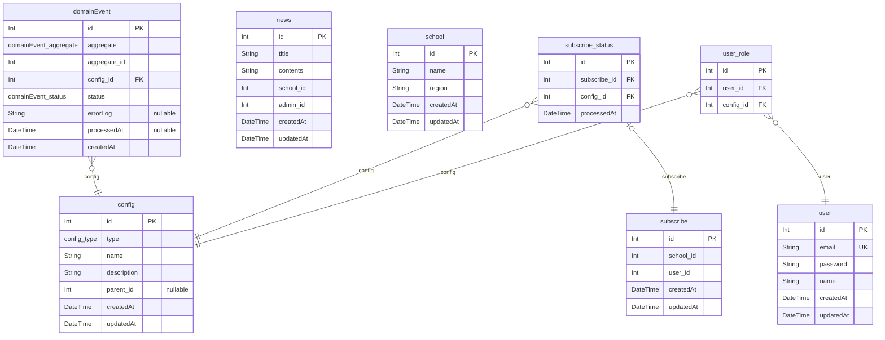

### 개발 환경

- IDE: VSCode
- Language: Node.js(20.11.1)
- Database: Mysql(v8.2.0)
- Web application framework: Nest.js(express)
- ORM: Prisma

### 실행 방법

- `config/dotenv/.env.*`의 mysql 연결 정보를 수정해주세요.
- `npm i --force`, `npm run prepare`, `npm run init:db`, `npm run gen:prisma`를 순서대로 실행해주세요.
- `npm run dev`로 서버를 실행해주세요. ("Server is running on 4000"가 출력되면 정상입니다.)
- `http://localhost:4000/docs`로 swagger document 확인 가능합니다.

### ERD

