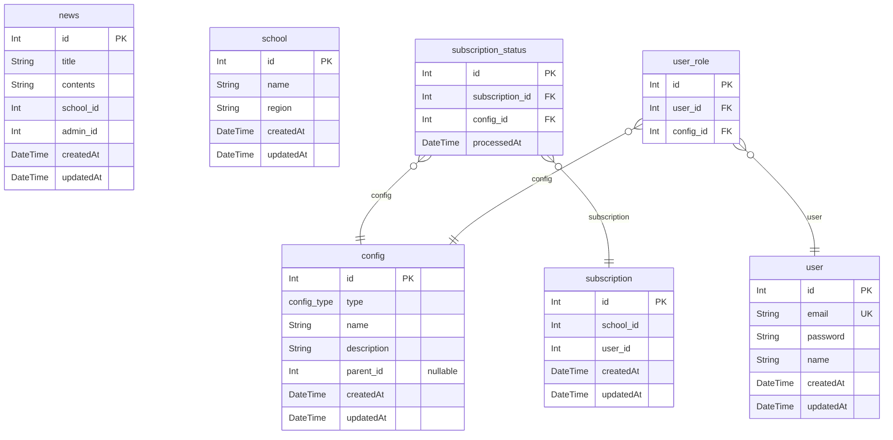

### 개발 환경

- IDE: VSCode
- Language: Node.js(20.11.1)
- Database: Mysql(v8.2.0)
- Web application framework: Nest.js(express)
- ORM: Prisma

### 실행 방법

- `config/dotenv/.env.*`의 mysql 연결 정보를 수정해주세요.
- `npm i --force`, `npm run prepare`, `npm run init:db`, `npm run gen:prisma`를 순서대로 실행해주세요.
- `npm run dev`로 서버를 실행해주세요. ("Server is running on 4000"가 출력되면 정상입니다.)
- `http://localhost:4000/docs`로 swagger document 확인 가능합니다.

### 구현 내용

- news(소식), school(학교), subscription(구독), user(유저) 4개의 도메인으로 구성.
- presentation -> application -> (domain) -> infrastructure의 레이어드 아키텍쳐.
- 필수 사항까지만 구현 및 테스트 완료했습니다.

### 테스트 코드

- test/@senario: api 통합 테스트. 요구사항을 검증합니다.
- test/[domain]: api 테스트. 해당 api를 검증합니다.
- 테스트 코드 실행 방법
  - `npm run e2e`로 테스트 서버를 실행합니다. (이전에 먼저 dev 서버를 종료해야 합니다.)
  - `npm run test:e2e`로 전체 테스트를 실행할 수 있습니다.
  - `npx jest --runInBand [file-path]`로 개별 테스트를 실행할 수 있습니다.

### ERD

