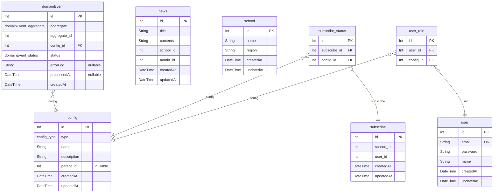

# ERD
> Generated by [`prisma-markdown`](https://github.com/samchon/prisma-markdown)

- [default](#default)

## default

### `config`

**Properties**
  - `id`: 
  - `type`: 
  - `name`: 
  - `description`: 
  - `parent_id`: 
  - `createdAt`: 
  - `updatedAt`: 

### `domainEvent`

**Properties**
  - `id`: 
  - `aggregate`: 
  - `aggregate_id`: 
  - `config_id`: 
  - `status`: 
  - `errorLog`: 
  - `processedAt`: 
  - `createdAt`: 

### `news`

**Properties**
  - `id`: 
  - `title`: 
  - `contents`: 
  - `school_id`: 
  - `admin_id`: 
  - `createdAt`: 
  - `updatedAt`: 

### `school`

**Properties**
  - `id`: 
  - `name`: 
  - `region`: 
  - `createdAt`: 
  - `updatedAt`: 

### `subscribe`

**Properties**
  - `id`: 
  - `school_id`: 
  - `user_id`: 
  - `createdAt`: 
  - `updatedAt`: 

### `subscribe_status`

**Properties**
  - `id`: 
  - `subscribe_id`: 
  - `config_id`: 

### `user`

**Properties**
  - `id`: 
  - `email`: 
  - `password`: 
  - `name`: 
  - `createdAt`: 
  - `updatedAt`: 

### `user_role`

**Properties**
  - `id`: 
  - `user_id`: 
  - `config_id`: 